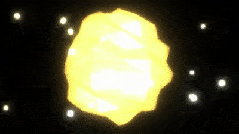

# threejs-lowpoly-sphere-bloom

Experiments with threeJS.

Dynamic sphere with some postprocessing pass applyed:
 - UnrealBloomPass
 - HorizontalBlurShader
 - VerticalBlurShader
 - RGBShiftPass 
 
</img>

